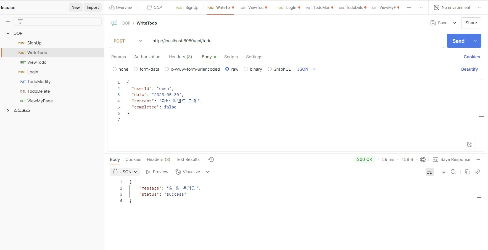
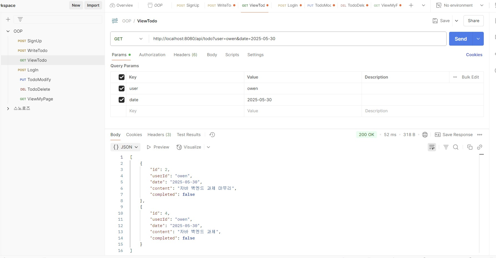
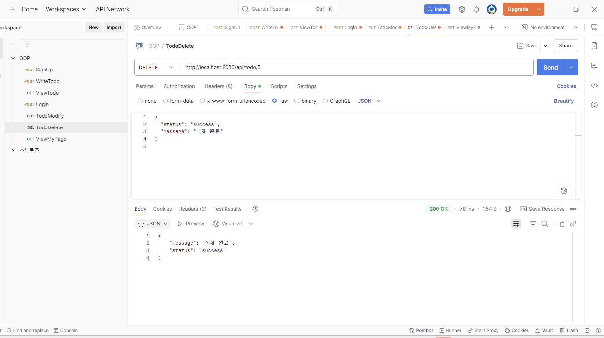

# 사용자 시스템 - Java 백엔드 서버

회원가입, 로그인, 마이페이지 조회, 할 일 관리 기능을 제공하는 Java 기반 사용자 시스템입니다.

---

## 서버 실행 방법

### 1. MySQL 실행 및 DB 생성
- DB 이름: `java_studyroom_project`
- user 테이블 생성:
  ```sql
  CREATE TABLE user (
      id INT AUTO_INCREMENT PRIMARY KEY,
      username VARCHAR(255) UNIQUE,
      password VARCHAR(255)
  );
  ```
- todo 테이블 생성:
  ```sql
  CREATE TABLE todo (
      id INT AUTO_INCREMENT PRIMARY KEY,
      user VARCHAR(255),
      content VARCHAR(255),
      completed BOOLEAN,
      date DATE
  );
  ```

### 2. Java 서버 실행
- `UserHttpServer.java` 실행
- 서버 포트: `8080`

$ javac -cp "lib/*" -d out src/usersystem/*.java src/usersystem/api/*.java src/usersystem/model/*.java src/usersystem/service/*.java src/usersystem/storage/*.java src/usersystem/utils/*.java

$ java -cp "lib/*;out" usersystem.UserHttpServer

## Postman 테스트 화면

### 할 일 추가 (POST /api/todo)


### 할 일 조회 (GET /api/todo)


### 할 일 수정 (PUT /api/todo/{id})


### 할 일 삭제 (DELETE /api/todo/{id})


### 마이페이지 조회 (GET /api/mypage)


## 필요 라이브러리

| 파일명 | 설명 |
|--------|------|
| `mysql-connector-j-9.3.0.jar` | MySQL DB 연동용 JDBC 드라이버 |
| `gson-2.10.1.jar` | JSON 직렬화/역직렬화 |

※ IntelliJ의 경우 File > Project Structure > Libraries에서 .jar 등록 필요

## API 명세서

### 할 일 추가
**URL:** `POST /api/todo`
```json
{
  "user": "owen",
  "date": "2025-05-30",
  "content": "자바 백엔드 과제",
  "completed": false
}
```

### 할 일 조회
**URL:** `GET /api/todo?user=owen&date=2025-05-30`

### 할 일 수정
**URL:** `PUT /api/todo/{todoId}`
```json
{
  "content": "내용 수정",
  "completed": true
}
```

### 할 일 삭제
**URL:** `DELETE /api/todo/{todoId}`

### 마이페이지 조회
**URL:** `GET /api/mypage?username=owen`
```json
{
  "username": "owen",
  "todoCount": 5
}
```

## 📂 프로젝트 파일 구성

```
java_studyroom_project/
├── UserHttpServer.java       # 서버 메인 실행 파일
├── api/                      # API 핸들러 클래스
├── model/                    # Todo, User 모델 클래스
├── service/                  # 비즈니스 로직
├── utils/                    # 유틸리티 (Query 파서 등)
├── DBTest.java               # DB 연결 테스트
├── lib/
│   ├── gson-2.10.1.jar
│   └── mysql-connector-j-9.3.0.jar
├── user.sql                  # DB 초기화 스크립트
└── README.md
```
